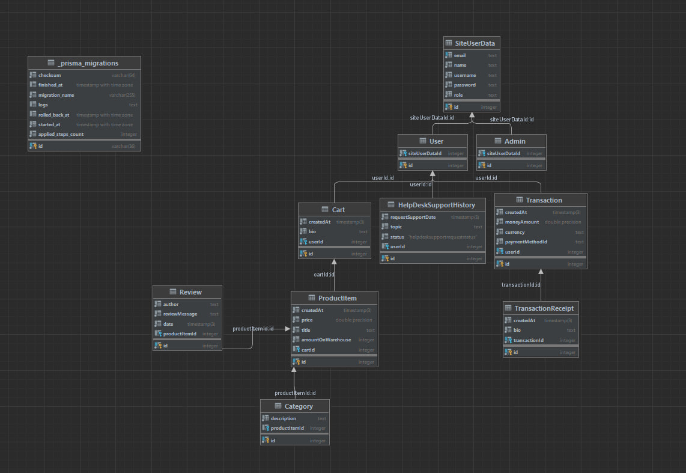

# Лабораторные работы по курсу "Web-программирование"
## Змушко Андрей М33031

## Схема web-сайта:
### [Основная страница сайта](https://azweb.onrender.com):

- _**SiteUserData**_ - абстракная сущность, которая обозначает пользователя сайта и хранит себе базовую информацию о пользователе внезависимости от его роли
- _**Admin**_ - администратор сайта, регулирует отзывы, занимается закупками
- _**User**_ - пользователь сайта, покупатель
- _**HelpDeskSupportHistory**_ - сущность истории обращений в техподдержку, содержит информацию об обращении (тема, дата, причина, статус)
- _**Transaction**_ - сущность, отвечающая за транзакцию, содержит детали оплаты
- _**TransactionReceipt**_ - сущность, содержашая в себе информацию о чеке покупки
- _**Cart**_ - сущность виртуальной корзины, в которую покупатель складывает товары
- _**ProductItem**_ - сущность товара магазина, хранит в себе базовую информацию о товаре
- _**Category**_ - сущность категории. каждый товар может относиться к категории
- _**Review**_ - сущность отзова, которые покупатели оставляют о купленном товаре